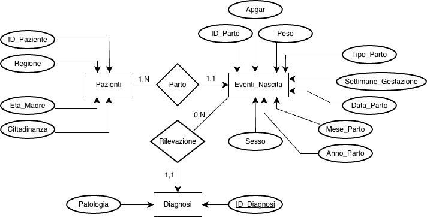
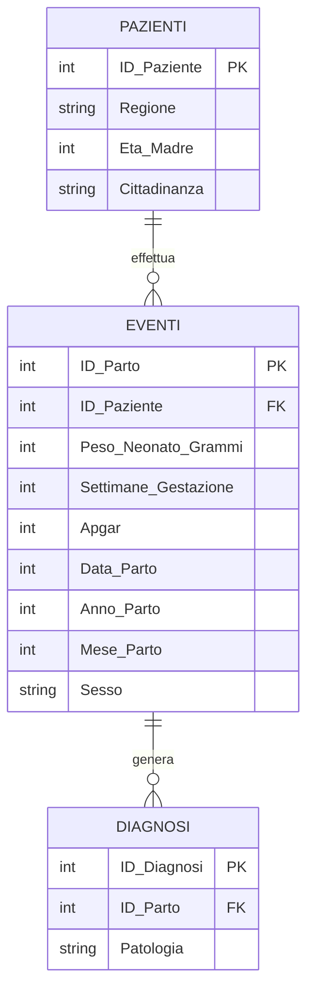
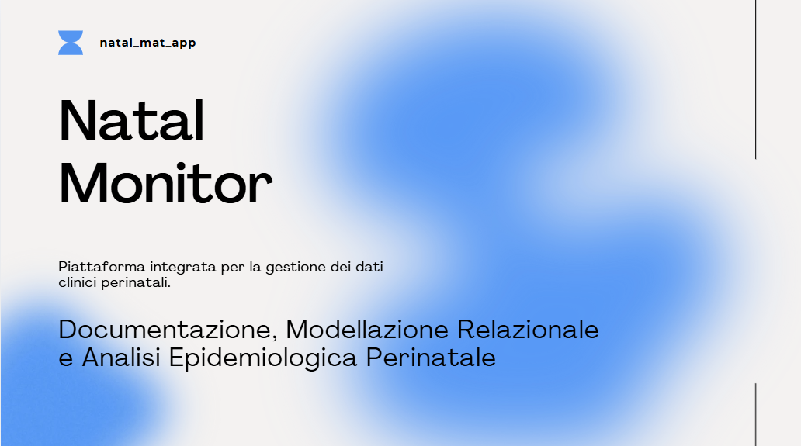

# NATAL MONITOR 

Il progetto consiste in un'applicazione software per l'analisi e il monitoraggio dei dati clinici in ambito ostetrico-ginecologico e perinatale, o perinatal care.

## Indice del Progetto

- [1. Introduzione e Obiettivi del Progetto](#1-introduzione-e-obiettivi-del-progetto)
- [2. Funzionalità Principali del Sistema](#2-funzionalità-principali-del-sistema)
  - [2.1 Gestione Anagrafica e Profilazione delle Pazienti](#21-gestione-anagrafica-e-profilazione-delle-pazienti)
  - [2.2 Tracciamento Longitudinale degli Eventi Nascita](#22-tracciamento-longitudinale-degli-eventi-nascita)
  - [2.3 Diagnostica e Rilevazione Anomalie Cliniche](#23-diagnostica-e-rilevazione-anomalie-cliniche)
- [3. Architettura Software: natal_mat_app](#3-architettura-software-natal_mat_app)
  - [3.1 Interfaccia Grafica (UI Dashboard)](#31-interfaccia-grafica-ui-dashboard)
  - [3.2 Logica ad Eventi (Callback) e Data Binding](#32-logica-ad-eventi-callback-e-data-binding)
- [4. Modellazione dei Dati (Database Relazionale)](#4-modellazione-dei-dati-database-relazionale)
  - [4.1 Diagramma Entità-Relazione (ER)](#41-diagramma-entità-relazione-er)
  - [4.2 Specifica delle Tabelle e Vincoli Relazionali](#42-specifica-delle-tabelle-e-vincoli-relazionali)
- [5. Struttura dei File e Avvio](#5-struttura-dei-file-e-avvio)
  - [5.1 Albero del Progetto](#51-albero-del-progetto)
  - [5.2 Requisiti di Sistema](#52-requisiti-di-sistema)
  - [5.3 Istruzioni per Avvio](#53-istruzioni-per-avvio)
- [6. PRESENTAZIONE POWERPOINT](#6-presentazione-powerpoint)

## 1. Introduzione e Obiettivi del Progetto
La scelta di sviluppare un'applicazione per il monitoraggio delle nascite nel territorio italiano deriva dalla registrazione di un'importante calo delle nascite annue nel nostro Paese negli ultimi cinque anni, denominato inverno demografico e che va quindi avanti dal 2021 fino ad oggi. (Proprio per questo motivo il range temporale scelto dalle analisi mostrate dai grafici va dal 2021 al 2026.)

È in oltre chiaro che il presente elaborato progettuale risponda anche alla necessità clinica e manageriale di centralizzare, storicizzare e analizzare i flussi di dati legati agli eventi di nascita e alla salute perinatale (*perinatal care*). 

Nel contesto sanitario moderno, la transizione dalle cartelle cliniche cartacee o dai fogli di calcolo isolati a sistemi informativi ospedalieri integrati è fondamentale per ridurre gli errori medici, garantire la continuità delle cure e permettere studi epidemiologici accurati sulla salute della madre e del neonato.

### Sistema di Monitoraggio Perinatale
Il progetto si propone come un prototipo di sistema informativo clinico basato su un'architettura a due livelli:
- **Backend Relazionale:** Un database locale **SQLite** ottimizzato, progettato per mappare in modo coerente le relazioni biologiche e cliniche tra la madre, la cartella clinica del parto e le diagnosi neonatali.
- **Frontend Analitico:** L'applicazione **`natal_mat_app`** sviluppata in ambiente **MATLAB App Designer**, che funge da cruscotto decisionale e dashboard visuale per il personale medico e i direttori sanitari.

### Obiettivi del Progetto
L'obiettivo ingegneristico del progetto è modellare e implementare un workflow realistico di gestione del dato biomedico, focalizzandosi sui seguenti traguardi:

1. **Garantire l'Integrità dei Dati (Data Ingegno & ETL):** Implementare routine software capaci di importare e ripulire i dati grezzi provenienti da formati non strutturati (fogli CSV), applicando i vincoli di integrità referenziale e standardizzando le variabili cliniche (es. età, peso, settimane gestazionali).
2. **Storicizzazione Longitudinale e Tracciabilità:** Permettere al sistema di legare indici clinici multipli (parti pregressi, complicanze) a una stessa scheda anagrafica paziente nel tempo, superando la logica del dato isolato.
3. **Fornire Supporto Decisionale Visivo:** Progettare un'interfaccia grafica (UI) reattiva ad alto contrasto che traduca query SQL complesse di aggregazione in KPI immediati e grafici statistici (`UIAxes`). Questo permette di monitorare istantaneamente:
   - Gli indici di vitalità neonatale (Punteggi APGAR).
   - I tassi di prematurità o di parti critici (es. tagli cesarei).
   - La distribuzione geografica e temporale dei ricoveri.
4. **Analisi Epidemiologica della Prevalenza:** Offrire uno strumento in grado di intercettare tempestivamente l'insorgenza e la distribuzione di pattern patologici (come distress respiratorio o ittero), facilitando l'allocazione delle risorse nei reparti di terapia intensiva neonatale (TIN).

##  2. Funzionalità principali del Sistema

Il sistema offre una piattaforma integrata per l'analisi e il monitoraggio dei dati clinici in ambito ostetrico-ginecologico e neonatale, strutturata nelle seguenti macro-funzionalità:

### 2.1 Gestione Anagrafica e Profilazione delle Pazienti
- **Anagrafica Centralizzata:** Organizzazione e visualizzazione delle informazioni fondamentali delle madri, inclusi l'età materna, la provenienza geografica (Regione) e lo stato di cittadinanza.
- **Calcolo Metriche di Baseline:** Elaborazione automatica di parametri fisiologici di base (come l'indice BMI materno) utili a definire il quadro clinico iniziale all'accettazione.

### 2.2 Tracciamento Longitudinale degli Eventi Nascita
- **Storicizzazione dei Parti:** Archiviazione e associazione dinamica di tutti gli eventi di nascita correlati a una specifica paziente, consentendo l'analisi della storia clinica della madre nel tempo (es. parti pregressi o gemellari).
- **Analisi Parametriche del Neonato:** Monitoraggio e catalogazione delle metriche essenziali del neonato alla nascita, tra cui:
  - Peso alla nascita (espresso in grammi).
  - Età gestazionale (espressa in settimane d'amniocentesi/ecografia).
  - Indice di vitalità (Punteggio APGAR a 1 e 5 minuti).
  - Variabili biologiche (Sesso del neonato).

### 2.3 Diagnostica e Rilevazione Anomalie Cliniche
- **Identificazione Stati Patologici:** Layer di analisi per l'individuazione e la persistenza delle complicanze neonatali o materne insorte durante o immediatamente dopo il parto (es. Ittero neonatale, Distress respiratorio, Prematurità).
- **Analisi dei Trend Temporali:** Monitoraggio dell'andamento dei parti e delle complicanze su base mensile e annuale, permettendo l'estrazione di statistiche epidemiologiche aggregate per singola macro-area geografica.

## 3. Architettura Software: natal_mat_app

L'applicazione **`natal_mat_app`** rappresenta il cuore operativo del progetto ed è sviluppata interamente tramite l'ambiente visuale **MATLAB App Designer**. Il software è ingegnerizzato seguendo il paradigma della programmazione ad eventi e si occupa della visualizzazione interattiva dei dati estratti dal database locale.

### 3.1 Interfaccia Grafica (UI Dashboard)
La dashboard è strutturata in sezioni ad alto contrasto per massimizzare la leggibilità dei dati clinici:
- **Sezione di Selezione e Filtraggio:** Menu a tendina interattivi (`UIDropdown`) che permettono all'utente di isolare i dati per specifiche Regioni o per specifici Anni storici di riferimento.
- **Pannelli dei KPI Clinici:** Campi testuali e label dinamiche che mostrano in tempo reale le medie matematiche e le percentuali aggregate (es. Età media delle madri, tasso di parti critici o prematuri nel periodo selezionato).
- **Assi di Plotting Interattivi (`UIAxes`):** Grafici integrati che mostrano visivamente la distribuzione geografica delle pazienti (istogrammi a barre), la stagionalità mensile dei parti (grafici di trend a linee) e la prevalenza delle patologie riscontrate (grafici a torta o distribuzioni categoriali).

### 3.2 Logica ad Eventi e Data Binding
Il backend del software in MATLAB è strettamente disaccoppiato dalla UI ed esegue le seguenti operazioni:
1. **Interfaccia SQL Nativa:** All'avvio o alla modifica dei filtri, l'app si connette al database SQLite tramite i comandi nativi di MATLAB, esegue query di aggregazione e aggiorna i componenti grafici in modo reattivo.
2. **Architettura basata su Callback:** Ogni interazione dell'utente sui controlli grafici attiva una funzione di callback dedicata che ricalcola istantaneamente le metriche visualizzate, garantendo la coerenza del dato senza necessità di riavviare l'applicazione.
3. **Integrità dei Dati:** I dati provenienti dai fogli di calcolo originali (`.csv`) vengono ripuliti (es. gestione degli apici nelle stringhe SQL) prima di essere storicizzati nel database relazionale, garantendo l'assenza di record corrotti nella UI.

## 4. Modellazione dei Dati (Database Relazionale)

Per garantire la coerenza, l'integrità referenziale e l'assenza di ridondanza informativa, i dati clinici sono stati organizzati in un database relazionale locale (SQLite) progettato in **Terza Forma Normale (3FN)**. Questa struttura permette di separare nettamente l'anagrafica immutabile della paziente dagli eventi clinici (i parti) e dalle diagnosi neonatali.

### 4.1 Diagramma Entità-Relazione (ER)



Il flusso logico dei dati e i vincoli di integrità del database sono rappresentati nel seguente diagramma:


### 4.2 Specifica delle Tabelle e Vincoli Relazionali
### Tabella 1: PAZIENTI
Contiene i dati anagrafici e il baseline demografico delle madri. Le informazioni rimangono stabili nel tempo e non vengono duplicate in caso di parti multipli della stessa donna.

- **ID_Paziente (INTEGER, Chiave Primaria, Autoincrement):** Identificativo univoco della paziente.

- **Regione (TEXT):** Regione di provenienza della madre per l'analisi epidemiologica territoriale.

- **Eta_Madre (INTEGER):** Età al momento del primo accesso/censimento.

- **Cittadinanza (TEXT):** Stato di cittadinanza della paziente (es. Italiana/Straniera).

### Tabella 2: EVENTI
Rappresenta il nucleo della storicizzazione longitudinale. Ogni record corrisponde a un singolo parto avvenuto nella struttura clinica ed è associato in modo univoco a una madre.

- **ID_Parto (INTEGER, Chiave Primaria, Autoincrement):** Identificativo univoco del parto.

- **ID_Paziente (INTEGER, Chiave Esterna):** Punta a PAZIENTI(ID_Paziente). Garantisce che nessun parto venga inserito senza una madre censita.

- **Anno_Evento / Mese_Evento (INTEGER):** Campi temporali usati dall'app per l'analisi della stagionalità dei ricoveri.

- **Peso_Neonato_Grammi (INTEGER):** Peso alla nascita, parametro critico per valutare la restrizione della crescita fetale.

- **Settimane_Gestazione (INTEGER):** Settimane di gestazione (es. <37 settimane indica un parto pretermine).

- **Apgar (1Min / 5Min) (INTEGER):** Punteggi di vitalità neonatale (range 0-10) registrati a uno e cinque minuti dal parto.

- **Sesso (TEXT):** Genere del nascituro.

### Tabella 3: DIAGNOSI
Tabella di lookup utilizzata per censire le patologie insorte nel neonato. È scorrelata dall'anagrafica della madre per permettere l'inserimento di più patologie diverse per lo stesso neonato (evitando campi vuoti o stringhe concatenate).

- **ID_Diagnosi (INTEGER, Chiave Primaria, Autoincrement):** Identificativo della singola diagnosi.

- **ID_Parto (INTEGER, Chiave Esterna)**: Punta a EVENTI(ID_Parto).

- **Tipo_Patologia (TEXT):** Codifica della complicanza riscontrata (es. Ittero, Distress Respiratorio, Asfissia Perinatale).

### **Analisi della Cardinalità delle Relazioni**

- **PAZIENTI (1) ─── (N) EVENTI**

Cardinalità: Uno a Molti.

Logica Clinica: Una madre può recarsi in ospedale nel corso della sua vita fertile per effettuare più parti (storicizzazione dei parti storici o gravidanze successive). Al contrario, ogni specifico evento di nascita registrato nel database può essere ricondotto a una e una sola madre.

- **EVENTI (1) ─── (N) DIAGNOSI**

Cardinalità: Uno a Molti (Zero a Molti).

Logica Clinica: Un parto può decorrere in modo perfetto senza alcuna complicazione per il neonato (zero record associati), oppure il neonato può presentare una o più patologie concomitanti che richiedono diagnosi separate (es. un neonato prematuro con ittero e distress respiratorio genererà due record distinti). Ogni record di complicanza appartiene però esclusivamente a quel singolo evento di nascita.

## 5. Struttura dei File e Avvio

### 5.1 Albero del Progetto
```text
Progetto_Perinatal_MATLAB/
│
├── natal_mat_app.m       # File core dell'applicazione (MATLAB App Designer)
├── generofogli.m         # Script ETL per la generazione e pulizia dei dati grezzi
│
├── pazienti.csv          # Dataset grezzo: Anagrafica delle madri
├── eventi_nascita.csv    # Dataset grezzo: Parametri clinici dei neonati
├── diagnosi.csv          # Dataset grezzo: Codifiche delle patologie riscontrate
│
├── natal_mat.db          # Database relazionale SQLite (generato automaticamente)
└── README.md             # Documentazione tecnica del progetto
```

### 5.2 Requisiti di Sistema
Per eseguire correttamente l'applicazione è necessario disporre di:

- **MATLAB** (Versione R2020a o successiva consigliata per il pieno supporto ad App Designer).

- **Database Toolbox** (o supporto nativo MATLAB alle funzioni sqlite e sqlwrite).

### 5.3 Istruzioni per Avvio
Per eseguire l'applicazione sul proprio computer locale, seguire questi passi in ordine:

- **Fase 1: Ingestion e Creazione del Database (ETL)**

- Prima di lanciare l'interfaccia grafica, è necessario elaborare i fogli CSV originari per creare e popolare il database SQLite relazionale.

- Aprire MATLAB.

- Navigare nella cartella del progetto (Progetto_Perinatal_MATLAB).

- Nella Command Window, digitare il comando ed eseguire:
```text
run('generofogli.m')
```
Al termine dell'esecuzione, all'interno della cartella comparirà il file natal_mat.db contenente le tabelle normalizzate e collegate tramite chiavi primarie ed esterne.

- **Fase 2: Apertura della Dashboard Grafica**

Una volta che il database è pronto e popolato, è possibile lanciare l'applicazione. 
- Nella Command Window di MATLAB, digitare ed eseguire:
```text
natal_mat_app
```
(In alternativa, fare doppio clic sul file natal_mat_app.m nel pannello "Current Folder" di MATLAB e cliccare sul pulsante verde Run in alto).

Si aprirà la finestra della dashboard e sarà possibile interagire con i menu a tendina per filtrare i dati clinici per Anno e Regione e osservare l'aggiornamento reattivo dei grafici epidemiologici e dei KPI delle pazienti.

### 6. PRESENTAZIONE POWERPOINT

Ecco la presentazione del progetto:

[](https://1drv.ms/p/c/52f014611d2bece0/IQRq5FCDNu-AQr2qxFsjwQaJAQMpiGnv27PVd9k8ZyaW5JE)


